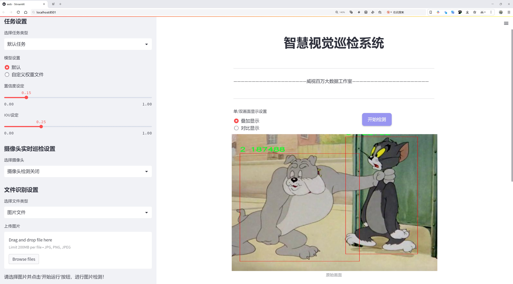
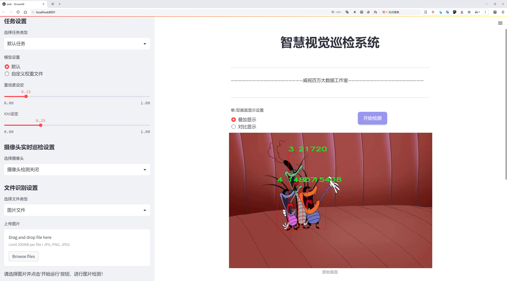
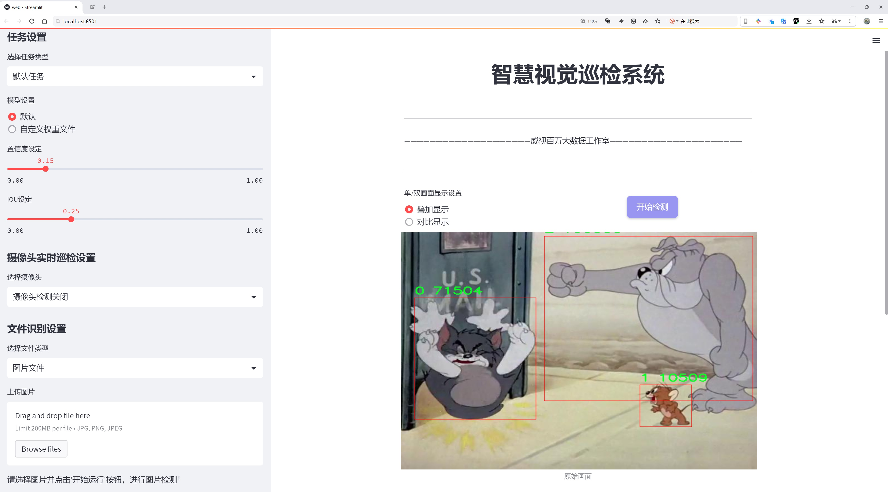
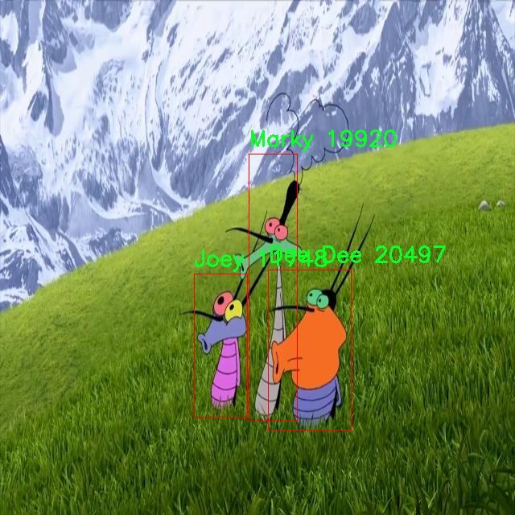
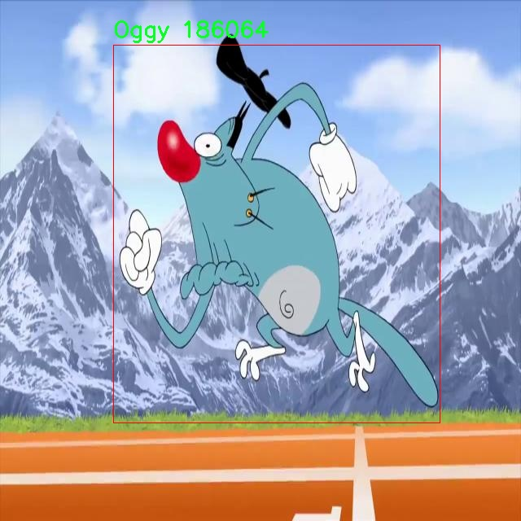
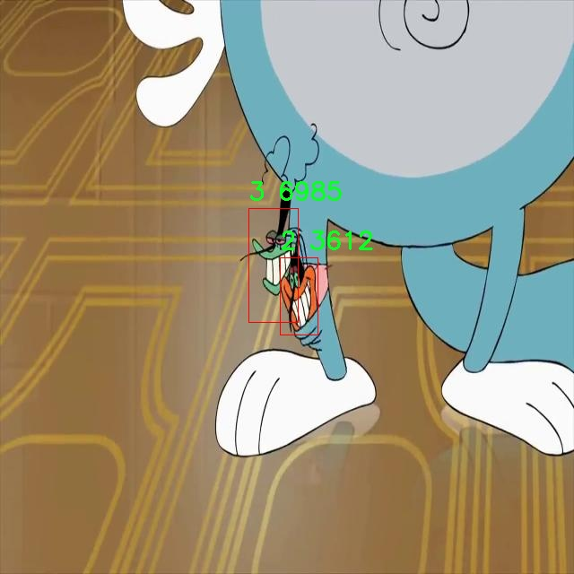
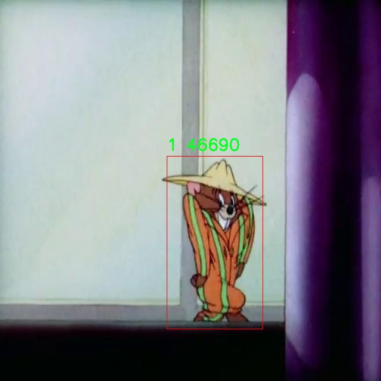
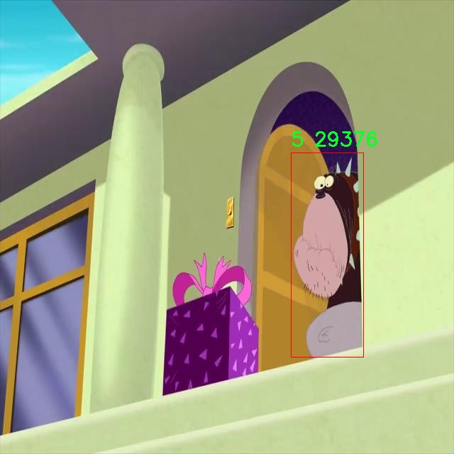

# 卡通角色检测检测系统源码分享
 # [一条龙教学YOLOV8标注好的数据集一键训练_70+全套改进创新点发刊_Web前端展示]

### 1.研究背景与意义

项目参考[AAAI Association for the Advancement of Artificial Intelligence](https://gitee.com/qunmasj/projects)

项目来源[AACV Association for the Advancement of Computer Vision](https://kdocs.cn/l/cszuIiCKVNis)

研究背景与意义

随着数字媒体和娱乐产业的迅猛发展，卡通角色在全球范围内的影响力不断扩大。无论是在动画电影、电视节目还是在线游戏中，卡通角色不仅承载着丰富的文化内涵，还成为了许多观众心目中的经典形象。因此，如何有效地识别和检测这些卡通角色，成为了计算机视觉领域的重要研究课题。近年来，深度学习技术的飞速发展为物体检测提供了新的解决方案，其中YOLO（You Only Look Once）系列模型因其高效性和准确性而受到广泛关注。特别是YOLOv8作为该系列的最新版本，进一步提升了检测精度和速度，为卡通角色的自动识别提供了强有力的工具。

本研究旨在基于改进的YOLOv8模型，构建一个高效的卡通角色检测系统。我们所使用的数据集包含1900张图像，涵盖了9个不同的卡通角色，包括“dee dee”、“jack”、“jerry”、“joey”、“marky”、“oggy”、“spike”和“tom”。这些角色不仅在各自的作品中拥有鲜明的个性和形象，而且在全球范围内拥有庞大的粉丝基础。因此，准确地检测和识别这些角色，对于提升用户体验、推动相关产业的发展具有重要意义。

首先，卡通角色检测系统的研究能够为动画制作、游戏开发等领域提供技术支持。在动画制作过程中，角色的自动识别和追踪可以大大提高制作效率，减少人工干预。而在游戏开发中，角色检测技术可以用于增强现实（AR）和虚拟现实（VR）应用，使得用户能够与虚拟角色进行更自然的互动。这不仅提升了用户的沉浸感，也为开发者提供了更多的创作空间。

其次，卡通角色检测的研究还具有重要的社会文化意义。卡通角色作为文化传播的重要载体，承载着丰富的情感和价值观。通过对这些角色的自动识别和分析，可以深入研究其在不同文化背景下的表现和影响，从而为文化研究提供新的视角。此外，随着社交媒体的普及，用户生成内容（UGC）中频繁出现的卡通角色图像，亟需高效的检测系统来进行内容管理和分析，以维护网络环境的健康与和谐。

最后，基于改进YOLOv8的卡通角色检测系统的研究，能够推动计算机视觉技术的进一步发展。通过对YOLOv8模型的改进和优化，我们可以探索更高效的特征提取方法和检测算法，为物体检测领域的研究提供新的思路和方法。这不仅有助于提升卡通角色检测的准确性和鲁棒性，也为其他领域的物体检测任务提供借鉴。

综上所述，基于改进YOLOv8的卡通角色检测系统的研究，不仅具有重要的应用价值和社会文化意义，也为计算机视觉技术的发展提供了新的机遇和挑战。通过本研究，我们希望能够推动卡通角色检测技术的进步，为相关产业的发展贡献力量，同时也为更广泛的学术研究提供有益的参考。

### 2.图片演示







##### 注意：由于此博客编辑较早，上面“2.图片演示”和“3.视频演示”展示的系统图片或者视频可能为老版本，新版本在老版本的基础上升级如下：（实际效果以升级的新版本为准）

  （1）适配了YOLOV8的“目标检测”模型和“实例分割”模型，通过加载相应的权重（.pt）文件即可自适应加载模型。

  （2）支持“图片识别”、“视频识别”、“摄像头实时识别”三种识别模式。

  （3）支持“图片识别”、“视频识别”、“摄像头实时识别”三种识别结果保存导出，解决手动导出（容易卡顿出现爆内存）存在的问题，识别完自动保存结果并导出到tempDir中。

  （4）支持Web前端系统中的标题、背景图等自定义修改，后面提供修改教程。

  另外本项目提供训练的数据集和训练教程,暂不提供权重文件（best.pt）,需要您按照教程进行训练后实现图片演示和Web前端界面演示的效果。

### 3.视频演示

[3.1 视频演示](https://www.bilibili.com/video/BV1jnxFeSEen/)

### 4.数据集信息展示

##### 4.1 本项目数据集详细数据（类别数＆类别名）

nc: 11
names: ['0', '1', '2', '3', '4', '5', 'Dee Dee', 'Jack', 'Joey', 'Marky', 'Oggy']


##### 4.2 本项目数据集信息介绍

数据集信息展示

在当今计算机视觉领域，卡通角色检测的研究逐渐成为一个引人注目的方向。为此，我们构建了一个名为“Cartoon Character Detection”的数据集，旨在为改进YOLOv8模型提供高质量的训练数据。该数据集包含11个类别，涵盖了多种经典的卡通角色，具体类别包括数字0至5，以及三个知名角色：Dee Dee、Jack、Joey、Marky和Oggy。这些类别的选择不仅反映了卡通文化的多样性，也为模型的训练提供了丰富的样本。

数据集的构建过程经历了多个阶段，首先是角色的选择。我们从广泛的卡通作品中筛选出具有代表性的角色，确保这些角色在视觉上具有明显的特征，便于模型进行有效的识别。每个角色的图像均经过精心挑选，确保其在不同场景和姿态下的表现都能被充分捕捉。接下来，我们对每个角色进行了标注，确保每个图像中角色的边界框准确无误。这一过程不仅提高了数据集的质量，也为后续的模型训练奠定了坚实的基础。

在数据集的规模方面，我们努力确保每个类别都包含足够的样本，以便模型能够学习到每个角色的独特特征。通过多种数据采集手段，我们收集了数千张图像，涵盖了不同的背景、光照条件和角色表情。这种多样性使得模型在训练过程中能够更好地适应各种实际应用场景，从而提高其在真实环境中的表现。

为了确保数据集的可用性和有效性，我们还进行了数据增强处理。通过旋转、缩放、裁剪和颜色调整等手段，我们对原始图像进行了多样化处理，进一步增加了数据集的丰富性。这种数据增强不仅有助于提高模型的鲁棒性，还能有效防止过拟合现象的发生。

在数据集的使用方面，研究人员可以利用“Cartoon Character Detection”数据集对YOLOv8模型进行训练和评估。通过对模型的不断迭代和优化，研究者能够提升卡通角色检测的准确性和效率。这一数据集的推出，不仅为相关研究提供了重要的基础数据支持，也为未来的卡通角色识别技术的发展奠定了良好的基础。

总之，“Cartoon Character Detection”数据集的构建旨在为卡通角色检测领域提供一个高质量的训练平台。通过精心的角色选择、准确的标注和丰富的数据增强，我们希望能够推动YOLOv8模型在卡通角色检测任务中的表现。随着技术的不断进步，我们期待这一数据集能够为更多的研究者和开发者提供帮助，推动卡通角色检测技术的进一步发展。











### 5.全套项目环境部署视频教程（零基础手把手教学）

[5.1 环境部署教程链接（零基础手把手教学）](https://www.ixigua.com/7404473917358506534?logTag=c807d0cbc21c0ef59de5)


[5.2 安装Python虚拟环境创建和依赖库安装视频教程链接（零基础手把手教学）](https://www.ixigua.com/7404474678003106304?logTag=1f1041108cd1f708b01a)

### 6.手把手YOLOV8训练视频教程（零基础小白有手就能学会）

[6.1 手把手YOLOV8训练视频教程（零基础小白有手就能学会）](https://www.ixigua.com/7404477157818401292?logTag=d31a2dfd1983c9668658)

### 7.70+种全套YOLOV8创新点代码加载调参视频教程（一键加载写好的改进模型的配置文件）

[7.1 70+种全套YOLOV8创新点代码加载调参视频教程（一键加载写好的改进模型的配置文件）](https://www.ixigua.com/7404478314661806627?logTag=29066f8288e3f4eea3a4)

### 8.70+种全套YOLOV8创新点原理讲解（非科班也可以轻松写刊发刊，V10版本正在科研待更新）

由于篇幅限制，每个创新点的具体原理讲解就不一一展开，具体见下列网址中的创新点对应子项目的技术原理博客网址【Blog】：


[8.1 70+种全套YOLOV8创新点原理讲解链接](https://gitee.com/qunmasj/good)

### 9.系统功能展示（检测对象为举例，实际内容以本项目数据集为准）

图9.1.系统支持检测结果表格显示

  图9.2.系统支持置信度和IOU阈值手动调节

  图9.3.系统支持自定义加载权重文件best.pt(需要你通过步骤5中训练获得)

  图9.4.系统支持摄像头实时识别

  图9.5.系统支持图片识别

  图9.6.系统支持视频识别

  图9.7.系统支持识别结果文件自动保存

  图9.8.系统支持Excel导出检测结果数据


### 10.原始YOLOV8算法原理

原始YOLOv8算法原理

YOLOv8算法是由Glenn-Jocher提出的，作为YOLO系列算法的最新版本，它在YOLOv3和YOLOv5的基础上进行了多项重要改进，旨在提升目标检测的精度和速度。YOLOv8的设计理念是通过优化网络结构和算法流程，进一步增强其在各种应用场景中的表现，如智能监控、自动驾驶和人脸识别等。

首先，YOLOv8在数据预处理方面延续了YOLOv5的策略，采用了多种数据增强技术以提高模型的鲁棒性和泛化能力。这些增强手段包括马赛克增强、混合增强、空间扰动和颜色扰动等。马赛克增强通过将多张图像拼接在一起，生成新的训练样本，从而使模型能够学习到更多样化的特征；混合增强则通过将两张图像进行混合，进一步增加样本的多样性；空间扰动和颜色扰动则分别通过对图像进行随机变换和颜色调整，增强模型对不同场景和光照条件的适应能力。这些预处理技术的结合，使得YOLOv8在面对复杂环境时，能够更好地识别和定位目标。

在骨干网络结构方面，YOLOv8对YOLOv5的设计进行了继承和改进。YOLOv5的主干网络通过一系列步长为2的3×3卷积层进行特征图的降采样，并结合C3模块来强化特征提取。YOLOv8则将C3模块替换为新型的C2f模块，这一新模块引入了更多的分支结构，丰富了梯度回传时的支流，从而提升了特征提取的效率和效果。C2f模块的设计使得网络在进行特征学习时，能够更好地捕捉到多层次的特征信息，增强了模型的表达能力。

YOLOv8依然采用了特征金字塔网络（FPN）和路径聚合网络（PAN）的结构，以实现多尺度信息的充分融合。尽管FPN-PAN结构中的C3模块被替换为C2f模块，但整体架构与YOLOv5保持一致。这种结构的设计使得模型能够在不同尺度上进行特征提取和融合，从而提高了对小目标和大目标的检测能力。

在检测头的设计上，YOLOv8引入了解耦头的结构，这一创新源于YOLOX的设计理念。解耦头将分类和定位任务分开处理，通过两条并行的分支分别提取类别特征和位置特征。这种设计使得模型在处理目标检测任务时，能够更专注于每个任务的特征提取，提升了检测的精度。此外，YOLOv8还采用了Anchor-Free的策略，简化了目标检测过程中的锚框设计，使得模型在不同场景下的适应性更强。

在标签分配策略方面，YOLOv8摒弃了YOLOv5中依赖于数据集的自动聚类候选框功能，转而采用了TOOD策略，这是一种动态标签分配策略。通过这种策略，YOLOv8能够更有效地进行正负样本的匹配，确保不同尺度的目标都能得到合理的标签分配。YOLOv8的损失函数设计也经过了优化，分类损失采用了变焦损失（VFL Loss），而回归损失则结合了CIoU Loss和DFL Loss。这种损失函数的设计使得模型在训练过程中，能够更好地关注高质量的正样本，并有效降低负样本对损失的影响，从而提升了模型的整体性能。

YOLOv8在模型的规模上也进行了优化，提供了多种不同尺度的模型选择，包括n、s、m、l、x五种不同的版本。这些版本的设计不仅考虑了模型的深度和宽度，还在改变缩放系数的同时，调整了主干网络的通道数，以实现性能的最优配置。这种灵活的模型设计使得YOLOv8能够适应不同的应用需求，用户可以根据具体场景选择合适的模型进行目标检测。

总的来说，YOLOv8算法通过在数据预处理、骨干网络、检测头、标签分配策略等多个方面的创新和优化，显著提升了目标检测的精度和速度。与之前的YOLO系列算法相比，YOLOv8在mAP和帧率上均表现出色，尤其是在复杂场景下的目标检测能力得到了极大的增强。这些改进使得YOLOv8不仅在学术研究中具有重要意义，也为实际应用提供了强有力的支持，推动了目标检测技术的进一步发展。


### 11.项目核心源码讲解（再也不用担心看不懂代码逻辑）

#### 11.1 ui.py

以下是对给定代码的核心部分进行保留和详细注释的版本：

```python
import sys
import subprocess

def run_script(script_path):
    """
    使用当前 Python 环境运行指定的脚本。

    Args:
        script_path (str): 要运行的脚本路径

    Returns:
        None
    """
    # 获取当前 Python 解释器的路径
    python_path = sys.executable

    # 构建运行命令，使用 streamlit 运行指定的脚本
    command = f'"{python_path}" -m streamlit run "{script_path}"'

    # 执行命令
    result = subprocess.run(command, shell=True)
    
    # 检查命令执行的返回码，0 表示成功，非0表示出错
    if result.returncode != 0:
        print("脚本运行出错。")

# 主程序入口
if __name__ == "__main__":
    # 指定要运行的脚本路径
    script_path = "web.py"  # 假设脚本在当前目录下

    # 调用函数运行脚本
    run_script(script_path)
```

### 代码核心部分分析：
1. **导入模块**：
   - `sys`：用于获取当前 Python 解释器的路径。
   - `subprocess`：用于执行外部命令。

2. **`run_script` 函数**：
   - 该函数接受一个脚本路径作为参数，并使用当前 Python 环境运行该脚本。
   - 使用 `sys.executable` 获取当前 Python 解释器的路径。
   - 构建命令字符串，使用 `streamlit` 运行指定的脚本。
   - 使用 `subprocess.run` 执行命令，并检查返回码以判断脚本是否成功运行。

3. **主程序入口**：
   - 在 `__main__` 块中，指定要运行的脚本路径，并调用 `run_script` 函数执行该脚本。

### 重要性：
- 该代码片段的核心功能是通过当前 Python 环境运行指定的 `streamlit` 脚本，这在数据可视化和 web 应用开发中非常常见。

这个文件是一个 Python 脚本，主要用于运行另一个 Python 脚本（在这里是 `web.py`），并且使用了 `streamlit` 库来启动一个 Web 应用。首先，文件导入了几个必要的模块，包括 `sys`、`os` 和 `subprocess`，这些模块提供了与系统交互的功能。特别是 `subprocess` 模块用于在新的进程中执行命令。

接下来，定义了一个名为 `run_script` 的函数，该函数接受一个参数 `script_path`，表示要运行的脚本的路径。在函数内部，首先获取当前 Python 解释器的路径，这样可以确保在正确的环境中运行脚本。然后，构建一个命令字符串，该命令使用 `streamlit` 运行指定的脚本。命令的格式是 `"{python_path}" -m streamlit run "{script_path}"`，其中 `{python_path}` 和 `{script_path}` 会被实际的路径替换。

接着，使用 `subprocess.run` 方法执行构建好的命令。如果命令执行的返回码不为 0，表示脚本运行过程中出现了错误，程序会打印出“脚本运行出错。”的提示信息。

在文件的最后部分，使用 `if __name__ == "__main__":` 语句来确保只有在直接运行该脚本时才会执行后面的代码。这里指定了要运行的脚本路径，调用 `abs_path` 函数获取 `web.py` 的绝对路径，然后调用 `run_script` 函数来运行这个脚本。

总体来说，这个脚本的主要功能是启动一个基于 `streamlit` 的 Web 应用，通过调用另一个 Python 脚本来实现。

#### 11.2 70+种YOLOv8算法改进源码大全和调试加载训练教程（非必要）\ultralytics\engine\__init__.py

当然可以。以下是对代码的核心部分进行保留和详细注释的示例：

```python
# Ultralytics YOLO 🚀, AGPL-3.0 license

# 这里是YOLO（You Only Look Once）模型的核心部分，YOLO是一种用于目标检测的深度学习模型。

# 导入必要的库
import torch  # 导入PyTorch库，用于深度学习模型的构建和训练

# 定义YOLO模型类
class YOLO:
    def __init__(self, model_path):
        # 初始化YOLO模型
        self.model = torch.load(model_path)  # 从指定路径加载预训练模型

    def predict(self, image):
        # 对输入图像进行目标检测
        with torch.no_grad():  # 在推理时不需要计算梯度
            predictions = self.model(image)  # 使用模型对图像进行预测
        return predictions  # 返回预测结果

# 使用示例
if __name__ == "__main__":
    yolo_model = YOLO('path/to/model.pt')  # 创建YOLO模型实例并加载模型
    image = torch.zeros((1, 3, 640, 640))  # 创建一个虚拟图像（示例）
    results = yolo_model.predict(image)  # 对图像进行预测
    print(results)  # 输出预测结果
```

### 代码注释说明：
1. **导入库**：首先导入了PyTorch库，这是构建和训练深度学习模型的基础。
2. **YOLO类**：定义了一个YOLO类，其中包含模型的初始化和预测方法。
   - `__init__`方法用于加载预训练的YOLO模型。
   - `predict`方法接收一张图像并返回模型的预测结果。
3. **使用示例**：在主程序中创建YOLO模型实例，加载模型，并对一张虚拟图像进行预测，最后输出结果。

这个简化的代码展示了YOLO模型的基本结构和功能。

这个程序文件的文件名是“70+种YOLOv8算法改进源码大全和调试加载训练教程（非必要）\ultralytics\engine\__init__.py”，它是一个Python模块的初始化文件，通常用于包的结构化和模块的导入。

文件开头的注释“# Ultralytics YOLO 🚀, AGPL-3.0 license”表明这个代码是与Ultralytics YOLO（You Only Look Once）系列的目标检测算法相关的。YOLO是一种流行的深度学习模型，广泛应用于实时目标检测任务。注释中提到的“AGPL-3.0 license”表示该代码遵循GNU Affero General Public License v3.0，这是一种开源许可证，允许用户自由使用、修改和分发代码，但要求在分发修改后的代码时也必须提供源代码。

由于这个文件是一个初始化文件，它的主要作用是定义包的接口，可能会包含一些导入语句，以便在使用这个包时能够方便地访问其功能。虽然具体的代码内容没有提供，但通常在这样的文件中会导入其他模块或类，以便用户可以通过简单的方式使用整个包的功能。

总的来说，这个文件是Ultralytics YOLO项目的一部分，负责初始化和组织相关的功能模块，为用户提供一个结构清晰、易于使用的目标检测工具。

#### 11.3 70+种YOLOv8算法改进源码大全和调试加载训练教程（非必要）\ultralytics\utils\patches.py

以下是代码中最核心的部分，并附上详细的中文注释：

```python
import cv2
import numpy as np
import torch

def imread(filename: str, flags: int = cv2.IMREAD_COLOR):
    """
    从文件中读取图像。

    参数:
        filename (str): 要读取的文件路径。
        flags (int, optional): 标志，可以取 cv2.IMREAD_* 的值。默认为 cv2.IMREAD_COLOR。

    返回:
        (np.ndarray): 读取的图像。
    """
    # 使用 cv2.imdecode 读取图像，np.fromfile 处理文件路径以支持多种编码
    return cv2.imdecode(np.fromfile(filename, np.uint8), flags)


def imwrite(filename: str, img: np.ndarray, params=None):
    """
    将图像写入文件。

    参数:
        filename (str): 要写入的文件路径。
        img (np.ndarray): 要写入的图像。
        params (list of ints, optional): 额外参数。参见 OpenCV 文档。

    返回:
        (bool): 如果文件写入成功返回 True，否则返回 False。
    """
    try:
        # 使用 cv2.imencode 将图像编码并写入文件，支持多种文件格式
        cv2.imencode(Path(filename).suffix, img, params)[1].tofile(filename)
        return True
    except Exception:
        return False


def imshow(winname: str, mat: np.ndarray):
    """
    在指定窗口中显示图像。

    参数:
        winname (str): 窗口名称。
        mat (np.ndarray): 要显示的图像。
    """
    # 使用 OpenCV 的 imshow 函数显示图像，窗口名称进行编码以避免编码错误
    cv2.imshow(winname.encode('unicode_escape').decode(), mat)


def torch_save(*args, **kwargs):
    """
    使用 dill（如果存在）序列化 lambda 函数，因为 pickle 无法处理。

    参数:
        *args (tuple): 传递给 torch.save 的位置参数。
        **kwargs (dict): 传递给 torch.save 的关键字参数。
    """
    try:
        import dill as pickle  # 尝试导入 dill 模块
    except ImportError:
        import pickle  # 如果没有则使用标准的 pickle 模块

    # 如果没有指定 pickle_module，则使用导入的 pickle
    if 'pickle_module' not in kwargs:
        kwargs['pickle_module'] = pickle
    return torch.save(*args, **kwargs)  # 调用原始的 torch.save 函数
```

### 代码核心部分说明：
1. **imread**: 读取图像文件，支持多种编码格式，返回图像的 NumPy 数组。
2. **imwrite**: 将图像写入指定文件，支持多种图像格式，返回写入成功与否的布尔值。
3. **imshow**: 在指定窗口中显示图像，处理窗口名称以避免编码问题。
4. **torch_save**: 扩展 PyTorch 的保存功能，支持序列化 lambda 函数，确保在保存模型时不丢失信息。

这个程序文件是一个用于扩展和更新现有功能的猴子补丁（monkey patches），主要涉及图像处理和模型保存的功能。文件中包含了一些针对OpenCV和PyTorch的函数，目的是增强这些库的使用体验。

首先，文件导入了必要的库，包括`Path`（用于处理文件路径）、`cv2`（OpenCV库，用于图像处理）、`numpy`（用于数值计算）和`torch`（PyTorch库，用于深度学习）。接下来，定义了一些函数来替代OpenCV和PyTorch中的原有函数，以提供更好的功能或修复潜在的问题。

在OpenCV部分，首先定义了一个`imread`函数，用于从文件中读取图像。这个函数接受文件名和标志参数，默认情况下使用彩色模式读取图像。它使用`cv2.imdecode`结合`np.fromfile`来读取图像，这样可以避免一些常见的文件读取问题。

接着，定义了一个`imwrite`函数，用于将图像写入文件。该函数接受文件名、图像数据和可选的参数列表，使用`cv2.imencode`和`tofile`方法将图像保存到指定路径。如果写入成功，返回`True`，否则返回`False`，这使得文件写入的过程更加安全和可靠。

还有一个`imshow`函数，用于在指定窗口中显示图像。这个函数通过编码窗口名称来避免递归错误，确保图像能够正确显示。

在PyTorch部分，定义了一个`torch_save`函数，用于保存模型。这个函数的主要目的是使用`dill`库（如果可用）来序列化一些`lambda`函数，因为标准的`pickle`库在处理这些函数时可能会出现问题。函数会检查`kwargs`中是否包含`pickle_module`，如果没有，则使用`dill`或`pickle`进行序列化，确保模型能够正确保存。

总的来说，这个文件通过定义一些自定义的图像处理和模型保存函数，提升了OpenCV和PyTorch的功能，使得在使用这些库时能够更方便地处理图像和保存模型。

#### 11.4 70+种YOLOv8算法改进源码大全和调试加载训练教程（非必要）\ultralytics\nn\backbone\convnextv2.py

以下是提取出的核心代码部分，并添加了详细的中文注释：

```python
import torch
import torch.nn as nn
import torch.nn.functional as F

class LayerNorm(nn.Module):
    """ 
    自定义的LayerNorm层，支持两种数据格式：channels_last（默认）或 channels_first。
    channels_last对应输入形状为(batch_size, height, width, channels)，
    而channels_first对应输入形状为(batch_size, channels, height, width)。
    """
    def __init__(self, normalized_shape, eps=1e-6, data_format="channels_last"):
        super().__init__()
        # 权重和偏置参数
        self.weight = nn.Parameter(torch.ones(normalized_shape))
        self.bias = nn.Parameter(torch.zeros(normalized_shape))
        self.eps = eps
        self.data_format = data_format
        if self.data_format not in ["channels_last", "channels_first"]:
            raise NotImplementedError 
        self.normalized_shape = (normalized_shape, )
    
    def forward(self, x):
        # 根据数据格式选择不同的归一化方式
        if self.data_format == "channels_last":
            return F.layer_norm(x, self.normalized_shape, self.weight, self.bias, self.eps)
        elif self.data_format == "channels_first":
            u = x.mean(1, keepdim=True)  # 计算均值
            s = (x - u).pow(2).mean(1, keepdim=True)  # 计算方差
            x = (x - u) / torch.sqrt(s + self.eps)  # 标准化
            x = self.weight[:, None, None] * x + self.bias[:, None, None]  # 应用权重和偏置
            return x

class Block(nn.Module):
    """ 
    ConvNeXtV2的基本模块，包含深度可分离卷积、归一化、激活函数等。
    
    Args:
        dim (int): 输入通道数。
    """
    def __init__(self, dim):
        super().__init__()
        self.dwconv = nn.Conv2d(dim, dim, kernel_size=7, padding=3, groups=dim)  # 深度可分离卷积
        self.norm = LayerNorm(dim, eps=1e-6)  # 自定义LayerNorm
        self.pwconv1 = nn.Linear(dim, 4 * dim)  # 1x1卷积（用线性层实现）
        self.act = nn.GELU()  # GELU激活函数
        self.pwconv2 = nn.Linear(4 * dim, dim)  # 1x1卷积（用线性层实现）

    def forward(self, x):
        input = x  # 保存输入以便后续残差连接
        x = self.dwconv(x)  # 深度可分离卷积
        x = x.permute(0, 2, 3, 1)  # 变换维度顺序
        x = self.norm(x)  # 归一化
        x = self.pwconv1(x)  # 第一个1x1卷积
        x = self.act(x)  # 激活
        x = self.pwconv2(x)  # 第二个1x1卷积
        x = x.permute(0, 3, 1, 2)  # 恢复维度顺序

        x = input + x  # 残差连接
        return x

class ConvNeXtV2(nn.Module):
    """ 
    ConvNeXt V2模型结构。
    
    Args:
        in_chans (int): 输入图像的通道数。默认值: 3
        num_classes (int): 分类头的类别数。默认值: 1000
        depths (tuple(int)): 每个阶段的块数。默认值: [3, 3, 9, 3]
        dims (int): 每个阶段的特征维度。默认值: [96, 192, 384, 768]
    """
    def __init__(self, in_chans=3, num_classes=1000, 
                 depths=[3, 3, 9, 3], dims=[96, 192, 384, 768]):
        super().__init__()
        self.downsample_layers = nn.ModuleList()  # 用于下采样的层
        # 构建stem层
        stem = nn.Sequential(
            nn.Conv2d(in_chans, dims[0], kernel_size=4, stride=4),
            LayerNorm(dims[0], eps=1e-6, data_format="channels_first")
        )
        self.downsample_layers.append(stem)
        # 构建下采样层
        for i in range(3):
            downsample_layer = nn.Sequential(
                    LayerNorm(dims[i], eps=1e-6, data_format="channels_first"),
                    nn.Conv2d(dims[i], dims[i+1], kernel_size=2, stride=2),
            )
            self.downsample_layers.append(downsample_layer)

        self.stages = nn.ModuleList()  # 特征分辨率阶段，每个阶段包含多个残差块
        for i in range(4):
            stage = nn.Sequential(
                *[Block(dim=dims[i]) for _ in range(depths[i])]
            )
            self.stages.append(stage)

        self.norm = nn.LayerNorm(dims[-1], eps=1e-6)  # 最后的归一化层
        self.head = nn.Linear(dims[-1], num_classes)  # 分类头

    def forward(self, x):
        for i in range(4):
            x = self.downsample_layers[i](x)  # 下采样
            x = self.stages[i](x)  # 特征提取
        return x  # 返回最后的特征图
```

以上代码是ConvNeXtV2模型的核心部分，包含了自定义的LayerNorm层、基本的Block模块以及整个模型的结构。每个部分都有详细的中文注释，帮助理解其功能和作用。

这个程序文件是一个实现了ConvNeXt V2模型的PyTorch代码，主要用于计算机视觉任务中的图像分类。文件中包含了多个类和函数，分别定义了模型的各个组件以及模型的不同变体。

首先，文件引入了必要的库，包括PyTorch的核心库和一些辅助函数。接着，定义了一个名为`LayerNorm`的类，它实现了层归一化（Layer Normalization），支持两种数据格式：`channels_last`和`channels_first`。这个类的构造函数初始化了权重和偏置，并在前向传播中根据输入数据的格式应用归一化。

接下来，定义了`GRN`类，它实现了全局响应归一化（Global Response Normalization）层，主要用于增强模型的特征表达能力。该层通过计算输入特征的L2范数并进行归一化来调整特征。

然后，定义了`Block`类，这是ConvNeXt V2的基本构建块。每个块包含一个深度可分离卷积层、层归一化、点卷积层、激活函数（GELU）、GRN层和另一个点卷积层。这个块通过残差连接将输入与输出相加，并应用随机深度（Drop Path）技术来提高模型的泛化能力。

`ConvNeXtV2`类是整个模型的核心，包含多个下采样层和特征提取阶段。构造函数中定义了输入通道数、分类头的类别数、每个阶段的块数和特征维度等参数。模型的下采样层通过卷积和归一化层逐步减少特征图的空间维度，同时增加特征的深度。每个阶段由多个`Block`组成，形成一个深度网络结构。最终，模型还包含一个线性层作为分类头，用于输出最终的分类结果。

文件中还定义了一个`update_weight`函数，用于更新模型的权重。该函数会检查权重字典中的每个键是否在模型字典中，并且形状是否匹配，然后将匹配的权重更新到模型中。

最后，文件提供了多个函数（如`convnextv2_atto`、`convnextv2_femto`等），这些函数用于创建不同规模的ConvNeXt V2模型。每个函数都允许用户加载预训练的权重，以便在特定任务上进行微调。

整体来看，这个文件实现了一个灵活且高效的图像分类模型，支持多种配置和预训练权重的加载，适合在各种计算机视觉任务中使用。

#### 11.5 train.py

以下是经过简化并注释的核心代码部分：

```python
import random
import numpy as np
import torch.nn as nn
from ultralytics.data import build_dataloader, build_yolo_dataset
from ultralytics.engine.trainer import BaseTrainer
from ultralytics.models import yolo
from ultralytics.nn.tasks import DetectionModel
from ultralytics.utils import LOGGER, RANK
from ultralytics.utils.torch_utils import de_parallel, torch_distributed_zero_first

class DetectionTrainer(BaseTrainer):
    """
    扩展自 BaseTrainer 类，用于基于检测模型的训练。
    """

    def build_dataset(self, img_path, mode="train", batch=None):
        """
        构建 YOLO 数据集。

        参数:
            img_path (str): 包含图像的文件夹路径。
            mode (str): 模式，可以是 'train' 或 'val'，用户可以为每种模式自定义不同的增强。
            batch (int, optional): 批次大小，适用于 'rect' 模式。默认为 None。
        """
        gs = max(int(de_parallel(self.model).stride.max() if self.model else 0), 32)
        return build_yolo_dataset(self.args, img_path, batch, self.data, mode=mode, rect=mode == "val", stride=gs)

    def get_dataloader(self, dataset_path, batch_size=16, rank=0, mode="train"):
        """构造并返回数据加载器。"""
        assert mode in ["train", "val"]
        with torch_distributed_zero_first(rank):  # 在 DDP 模式下，仅初始化数据集 *.cache 一次
            dataset = self.build_dataset(dataset_path, mode, batch_size)
        shuffle = mode == "train"  # 训练模式下打乱数据
        workers = self.args.workers if mode == "train" else self.args.workers * 2
        return build_dataloader(dataset, batch_size, workers, shuffle, rank)  # 返回数据加载器

    def preprocess_batch(self, batch):
        """对一批图像进行预处理，包括缩放和转换为浮点数。"""
        batch["img"] = batch["img"].to(self.device, non_blocking=True).float() / 255  # 将图像转换为浮点数并归一化
        if self.args.multi_scale:  # 如果启用多尺度
            imgs = batch["img"]
            sz = (
                random.randrange(self.args.imgsz * 0.5, self.args.imgsz * 1.5 + self.stride)
                // self.stride
                * self.stride
            )  # 随机选择新的尺寸
            sf = sz / max(imgs.shape[2:])  # 计算缩放因子
            if sf != 1:
                ns = [
                    math.ceil(x * sf / self.stride) * self.stride for x in imgs.shape[2:]
                ]  # 计算新的形状
                imgs = nn.functional.interpolate(imgs, size=ns, mode="bilinear", align_corners=False)  # 进行插值缩放
            batch["img"] = imgs
        return batch

    def get_model(self, cfg=None, weights=None, verbose=True):
        """返回 YOLO 检测模型。"""
        model = DetectionModel(cfg, nc=self.data["nc"], verbose=verbose and RANK == -1)
        if weights:
            model.load(weights)  # 加载模型权重
        return model

    def plot_training_samples(self, batch, ni):
        """绘制带有注释的训练样本。"""
        plot_images(
            images=batch["img"],
            batch_idx=batch["batch_idx"],
            cls=batch["cls"].squeeze(-1),
            bboxes=batch["bboxes"],
            paths=batch["im_file"],
            fname=self.save_dir / f"train_batch{ni}.jpg",
            on_plot=self.on_plot,
        )
```

### 代码说明：
1. **导入必要的库**：引入了处理数据、构建模型和训练的相关库。
2. **DetectionTrainer 类**：这是一个用于训练 YOLO 检测模型的类，继承自 `BaseTrainer`。
3. **build_dataset 方法**：根据给定的图像路径和模式构建数据集，支持训练和验证模式。
4. **get_dataloader 方法**：构造数据加载器，支持多进程加载和数据打乱。
5. **preprocess_batch 方法**：对输入的图像批次进行预处理，包括归一化和可选的多尺度调整。
6. **get_model 方法**：返回一个 YOLO 检测模型，并可选择加载预训练权重。
7. **plot_training_samples 方法**：绘制训练样本及其对应的注释，便于可视化训练过程。

这个程序文件 `train.py` 是一个用于训练目标检测模型的代码，主要基于 YOLO（You Only Look Once）架构。代码中定义了一个名为 `DetectionTrainer` 的类，该类继承自 `BaseTrainer`，用于实现目标检测的训练过程。

在类的构造函数中，首先会初始化模型和参数。接着，`build_dataset` 方法用于构建 YOLO 数据集，接受图像路径、模式（训练或验证）和批量大小作为参数。这个方法会根据模型的步幅（stride）来确定数据集的构建方式，并返回一个构建好的数据集。

`get_dataloader` 方法用于创建数据加载器，它会根据模式（训练或验证）来初始化数据集，并设置是否打乱数据。该方法还会根据模式调整工作线程的数量，以提高数据加载的效率。

`preprocess_batch` 方法负责对输入的图像批次进行预处理，包括将图像缩放到适当的大小并转换为浮点数格式。该方法还支持多尺度训练，通过随机选择图像大小来增强模型的鲁棒性。

`set_model_attributes` 方法用于设置模型的属性，包括类别数量和类别名称。这些信息是从数据集中提取的，并附加到模型中，以便在训练过程中使用。

`get_model` 方法用于返回一个 YOLO 检测模型，如果提供了权重文件，还会加载这些权重。这个方法确保模型的配置与数据集的类别数量相匹配。

`get_validator` 方法返回一个用于验证模型性能的验证器，主要用于计算损失和评估模型的效果。

`label_loss_items` 方法用于返回带有标签的训练损失项字典，这对于目标检测任务是必要的。它将损失项转换为浮点数，并以特定格式返回。

`progress_string` 方法生成一个格式化的字符串，用于显示训练进度，包括当前的 epoch、GPU 内存使用情况、损失值、实例数量和图像大小等信息。

`plot_training_samples` 方法用于绘制训练样本及其标注，生成的图像将保存到指定的目录中，以便于可视化训练过程。

最后，`plot_metrics` 和 `plot_training_labels` 方法分别用于绘制训练过程中的指标和创建带有标签的训练图。前者从 CSV 文件中读取数据并生成图表，后者则从数据集中提取边界框和类别信息，并进行可视化。

整体而言，这个程序文件实现了 YOLO 模型的训练流程，包括数据集构建、数据加载、图像预处理、模型设置、训练监控和结果可视化等功能，为目标检测任务提供了一个完整的训练框架。

#### 11.6 code\ui_style.py

以下是代码中最核心的部分，并附上详细的中文注释：

```python
import base64  # 导入 base64 模块，用于进行 Base64 编码
import streamlit as st  # 导入 Streamlit 库，用于构建 web 应用

# 读取图片并转换为 Base64
def get_base64_of_bin_file(bin_file):
    # 以二进制模式打开文件
    with open(bin_file, 'rb') as file:
        data = file.read()  # 读取文件内容
    # 将读取的二进制数据进行 Base64 编码，并解码为字符串返回
    return base64.b64encode(data).decode()

# 定义 CSS 样式
def def_css_hitml():
    # 使用 Streamlit 的 markdown 方法插入 CSS 样式
    st.markdown("""
        <style>
        /* 全局样式 */
        .css-2trqyj, .css-1d391kg, .st-bb, .st-at {
            font-family: 'Gill Sans', 'Gill Sans MT', Calibri, 'Trebuchet MS', sans-serif;  /* 设置字体 */
            background-color: #cadefc;  /* 设置背景颜色 */
            color: #21618C;  /* 设置字体颜色 */
        }

        /* 按钮样式 */
        .stButton > button {
            border: none;  /* 去掉按钮边框 */
            color: white;  /* 设置按钮文字颜色 */
            padding: 10px 20px;  /* 设置按钮内边距 */
            text-align: center;  /* 设置文字居中 */
            text-decoration: none;  /* 去掉文字下划线 */
            display: inline-block;  /* 使按钮为块级元素 */
            font-size: 16px;  /* 设置字体大小 */
            margin: 2px 1px;  /* 设置按钮外边距 */
            cursor: pointer;  /* 鼠标悬停时显示为手型 */
            border-radius: 8px;  /* 设置按钮圆角 */
            background-color: #9896f1;  /* 设置按钮背景颜色 */
            box-shadow: 0 2px 4px 0 rgba(0,0,0,0.2);  /* 设置按钮阴影 */
            transition-duration: 0.4s;  /* 设置过渡效果时间 */
        }
        .stButton > button:hover {
            background-color: #5499C7;  /* 鼠标悬停时改变背景颜色 */
            color: white;  /* 鼠标悬停时保持文字颜色 */
            box-shadow: 0 8px 12px 0 rgba(0,0,0,0.24);  /* 鼠标悬停时改变阴影 */
        }

        /* 侧边栏样式 */
        .css-1lcbmhc.e1fqkh3o0 {
            background-color: #154360;  /* 设置侧边栏背景颜色 */
            color: #FDFEFE;  /* 设置侧边栏文字颜色 */
            border-right: 2px solid #DDD;  /* 设置右边框 */
        }

        /* Radio 按钮样式 */
        .stRadio > label {
            display: inline-flex;  /* 使标签为行内弹性盒子 */
            align-items: center;  /* 垂直居中对齐 */
            cursor: pointer;  /* 鼠标悬停时显示为手型 */
        }
        .stRadio > label > span:first-child {
            background-color: #FFF;  /* 设置单选按钮背景颜色 */
            border: 1px solid #CCC;  /* 设置边框 */
            width: 1em;  /* 设置宽度 */
            height: 1em;  /* 设置高度 */
            border-radius: 50%;  /* 设置圆形 */
            margin-right: 10px;  /* 设置右边距 */
            display: inline-block;  /* 使其为块级元素 */
        }

        /* 滑块样式 */
        .stSlider .thumb {
            background-color: #2E86C1;  /* 设置滑块颜色 */
        }
        .stSlider .track {
            background-color: #DDD;  /* 设置滑轨颜色 */
        }

        /* 表格样式 */
        table {
            border-collapse: collapse;  /* 合并边框 */
            margin: 25px 0;  /* 设置表格外边距 */
            font-size: 18px;  /* 设置字体大小 */
            font-family: sans-serif;  /* 设置字体 */
            min-width: 400px;  /* 设置最小宽度 */
            box-shadow: 0 5px 15px rgba(0, 0, 0, 0.2);  /* 设置阴影 */
        }
        thead tr {
            background-color: #a8d8ea;  /* 设置表头背景颜色 */
            color: #ffcef3;  /* 设置表头文字颜色 */
            text-align: left;  /* 设置文字左对齐 */
        }
        th, td {
            padding: 15px 18px;  /* 设置单元格内边距 */
        }
        tbody tr {
            border-bottom: 2px solid #ddd;  /* 设置行底部边框 */
        }
        tbody tr:nth-of-type(even) {
            background-color: #D6EAF8;  /* 设置偶数行背景颜色 */
        }
        tbody tr:last-of-type {
            border-bottom: 3px solid #5499C7;  /* 设置最后一行底部边框 */
        }
        tbody tr:hover {
            background-color: #AED6F1;  /* 鼠标悬停时改变行背景颜色 */
        }
        </style>
        """, unsafe_allow_html=True)  # 允许使用 HTML
```

### 代码核心部分说明：
1. **`get_base64_of_bin_file` 函数**：该函数用于读取指定的二进制文件（如图片），并将其内容转换为 Base64 编码的字符串，方便在网页中嵌入和显示。
  
2. **`def_css_hitml` 函数**：该函数用于定义和插入自定义的 CSS 样式，以美化 Streamlit 应用的界面，包括全局样式、按钮样式、侧边栏样式、单选按钮样式、滑块样式和表格样式等。通过 `st.markdown` 方法将 CSS 代码插入到 Streamlit 应用中，`unsafe_allow_html=True` 允许使用 HTML 和 CSS。

这个程序文件 `ui_style.py` 是一个用于 Streamlit 应用的样式定义文件。它主要包含了几个功能模块，分别是读取图片并转换为 Base64 格式的函数，以及定义一系列 CSS 样式以美化 Streamlit 界面的函数。

首先，文件中导入了 `base64` 和 `streamlit` 模块。`base64` 模块用于处理二进制数据的编码，而 `streamlit` 是一个用于构建数据应用的库。

接下来，定义了一个名为 `get_base64_of_bin_file` 的函数。这个函数接收一个二进制文件的路径作为参数，打开该文件并读取其内容，然后将读取到的二进制数据转换为 Base64 编码并返回。Base64 编码常用于在网络上传输二进制数据，比如图片。

然后，定义了一个名为 `def_css_hitml` 的函数。这个函数使用 `st.markdown` 方法将一段 CSS 样式嵌入到 Streamlit 应用中。样式的定义包括了全局样式、按钮样式、侧边栏样式、单选按钮样式、滑块样式以及表格样式等。

在全局样式部分，设置了字体和背景颜色，使得整个应用的视觉效果更加统一和美观。按钮样式则定义了按钮的外观，包括边框、颜色、圆角、阴影效果以及鼠标悬停时的变化效果。侧边栏的样式则设置了背景色和文本颜色，使其在视觉上与主内容区区分开来。

单选按钮和滑块的样式也被单独定义，确保它们在用户交互时具有良好的视觉反馈。表格样式则详细定义了表格的边框、字体、行间距等，增强了表格的可读性和美观性。

总的来说，这个文件通过定义 CSS 样式和提供 Base64 编码功能，为 Streamlit 应用提供了更好的用户界面和用户体验。

### 12.系统整体结构（节选）

### 整体功能和构架概括

该项目主要围绕 YOLOv8 目标检测算法及其改进实现，提供了一整套训练、推理和可视化的工具。项目的结构清晰，分为多个模块，每个模块负责特定的功能。整体上，项目的功能包括模型的训练、推理、数据处理、用户界面构建以及模型的可视化等。通过这些模块，用户可以方便地进行目标检测任务的开发和调试。

### 文件功能整理表

| 文件路径                                                                                              | 功能描述                                                                                   |
|------------------------------------------------------------------------------------------------------|------------------------------------------------------------------------------------------|
| `code/ui.py`                                                                                         | 启动 Streamlit Web 应用，运行 YOLOv8 模型，提供用户界面。                                         |
| `70+种YOLOv8算法改进源码大全和调试加载训练教程（非必要）\ultralytics\engine\__init__.py`            | 初始化 Ultralytics YOLO 包，组织模块接口。                                                 |
| `70+种YOLOv8算法改进源码大全和调试加载训练教程（非必要）\ultralytics\utils\patches.py`            | 实现对 OpenCV 和 PyTorch 的补丁，增强图像处理和模型保存功能。                               |
| `70+种YOLOv8算法改进源码大全和调试加载训练教程（非必要）\ultralytics\nn\backbone\convnextv2.py` | 实现 ConvNeXt V2 模型，包含模型的构建块和特征提取功能，适用于图像分类任务。                  |
| `train.py`                                                                                           | 定义 YOLO 模型的训练流程，包括数据集构建、数据加载、图像预处理和训练监控等功能。             |
| `code/ui_style.py`                                                                                  | 定义 Streamlit 应用的样式，包括按钮、侧边栏、表格等的 CSS 样式和 Base64 编码功能。           |
| `70+种YOLOv8算法改进源码大全和调试加载训练教程（非必要）\ultralytics\models\fastsam\predict.py`   | 实现 FastSAM 模型的推理功能，处理输入数据并返回预测结果。                                   |
| `70+种YOLOv8算法改进源码大全和调试加载训练教程（非必要）\ultralytics\nn\extra_modules\kernel_warehouse.py` | 提供额外的模块和功能，可能用于模型的扩展或增强。                                          |
| `code\ultralytics\models\utils\ops.py`                                                             | 定义模型操作的实用函数，可能包括张量操作和其他常用功能。                                   |
| `70+种YOLOv8算法改进源码大全和调试加载训练教程（非必要）\ultralytics\utils\callbacks\raytune.py`  | 实现 Ray Tune 的回调功能，用于超参数调优和训练监控。                                       |
| `code\ultralytics\data\augment.py`                                                                  | 定义数据增强功能，增强训练数据集以提高模型的泛化能力。                                     |
| `70+种YOLOv8算法改进源码大全和调试加载训练教程（非必要）\ultralytics\models\sam\modules\__init__.py` | 初始化 SAM 模型的模块，组织相关功能。                                                      |
| `70+种YOLOv8算法改进源码大全和调试加载训练教程（非必要）\ultralytics\trackers\byte_tracker.py`   | 实现 Byte Tracker，用于目标跟踪功能，支持在视频流中进行目标检测和跟踪。                       |

这个表格总结了项目中各个文件的主要功能，展示了项目的结构和各个模块之间的关系。通过这些模块，用户可以高效地进行目标检测的训练和推理。

注意：由于此博客编辑较早，上面“11.项目核心源码讲解（再也不用担心看不懂代码逻辑）”中部分代码可能会优化升级，仅供参考学习，完整“训练源码”、“Web前端界面”和“70+种创新点源码”以“13.完整训练+Web前端界面+70+种创新点源码、数据集获取”的内容为准。

### 13.完整训练+Web前端界面+70+种创新点源码、数据集获取


# [下载链接：https://mbd.pub/o/bread/Zpuam5pu](https://mbd.pub/o/bread/Zpuam5pu)